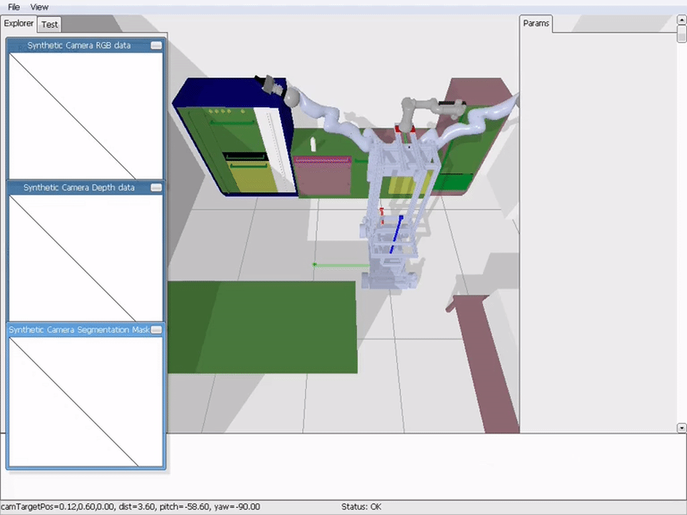

# What is PyCRAM

PyCRAM is the Python 3 re-implementation of [CRAM](https://github.com/cram2/cram).
PyCRAM is a toolbox for designing, implementing and deploying software on autonomous robots. The framework provides various tools and libraries for aiding in robot software development as well as geometric reasoning and fast simulation mechanisms to develop cognition-enabled control programs that achieve high levels of robot autonomy. 

PyCRAM is developed in Python with support for the ROS middleware which is used for communication with different software components as well as the robot. 

This framework is tested with Ubuntu 20.04, ROS Noetic and Python 3.8


## Simple Demonstartion
PyCRAM allows the execution of the same high-level plan on different robot platforms. Below you can see an example of this where the plan is executed on the PR2 and the IAIs Boxy. 

Boxy            |  PR2
:-------------------------:|:-------------------------:
  |  

The plan that both robots execute is a relativly simple pick and place plan:
* They start at the world origin 
* park their arms 
* move to the counter 
* observe the object 
* pickup the object 
* move to the kitchen island
* place the object 
* move to the world origin

The code for this plan can be seen below.
```
@with_simulated_robot
def plan():
    MotionDesignator(MoveArmJointsMotionDescription(left_arm_config='park',
                right_arm_config='park')).perform()

    MotionDesignator(MoveMotionDescription(target=moving_targets[robot_name]["sink"][0],
                  orientation=moving_targets[robot_name]["sink"][1])).perform()

    det_obj = MotionDesignator(DetectingMotionDescription(object_type="milk")).perform()

    MotionDesignator(PickUpMotionDescription(object=milk, arm="left", grasp="front")).perform()


    MotionDesignator(MoveMotionDescription(target=moving_targets[robot_name]["island"][0],
                    orientation=moving_targets[robot_name]["island"][1])).perform()
                    
    MotionDesignator(PlaceMotionDescription(object=milk, target=[-0.9, 1, 0.93], arm="left")).perform()

    MotionDesignator(MoveArmJointsMotionDescription(left_arm_config='park', 
                        right_arm_config='park')).perform()

    MotionDesignator(MoveMotionDescription(target=[0.0, 0.0, 0],
                                            orientation=[0, 0, 0, 1])).perform()

```


## Installation 
For information on installing PyCRAM please check the guid on the website:
[Website](http://cram-system.org/pycram/installation)

## Documentation

The documentation for the different parts of PyCRAM can be found [here](http://cram-system.org/pycram#documentation). 


## Tutorials 
There are a handful of tutorials to get you started on using PyCRAM. These tutorials are:
* [Setup your Python REPL](http://cram-system.org/tutorials/pycram/repl)
* [Interact with the BulletWorld](http://cram-system.org/tutorials/pycram/bullet_world)
* [Add your own robot](http://cram-system.org/tutorials/pycram/own_robot)
 


## Authors

* **Jonas Dech** <jdech@uni-bremen.de>
* **Andy Augsten** <a.augsten@uni-bremen.de>
* **Dustin Augsten** <augsten@uni-bremen.de>
* **Christopher Pollok** <cpollok@uni-bremen.de>
* **Thomas Lipps** <tlipps@uni-bremen.de>
* **Benjamin Alt** <benjamin.alt@uni-bremen.de>

